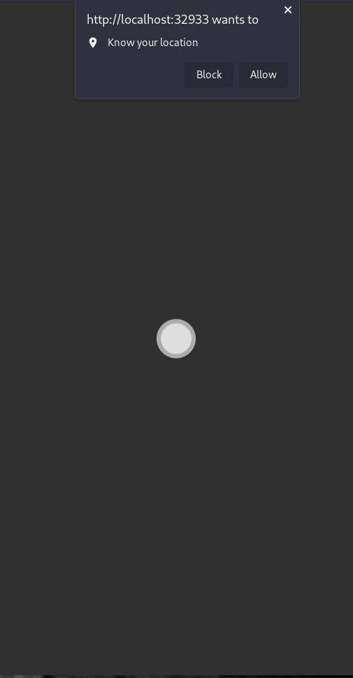
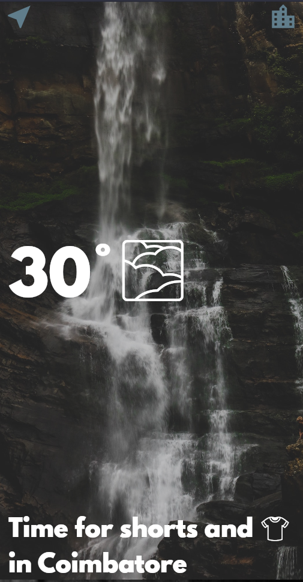

# clima

A new Flutter project to show the current weather condition using API(OpenWeather) implementation.      
Setting Up the Project :        
Step 1 : Clone the project or Download the project as Zip.      
Step 2 : Open your VS code or IDE with flutter extension installed and SDK setted previously.       
Step 3 : Open this project.     
Step 4 : Open your terminal and type 'flutter pub get', this gets the dependencies.     
Step 5 : Run the project with the command, 'flutter run'
## Screenshots : 

